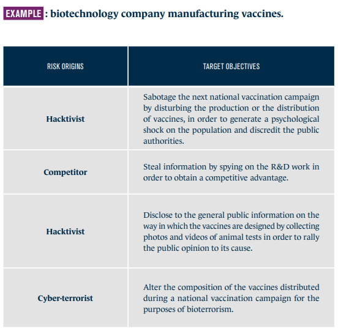
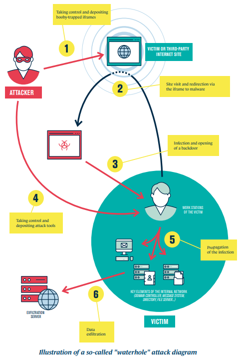

# What isEBIOS?
EBIOS Risk Manager [(EBIOS RM)](https://cyber.gouv.fr/publications/ebios-risk-manager-method) is the method for assessing and treating digital risks published by National Cybersecurity Agency of France (ANSSI) with the support of Club EBIOS.

EBIOS RM makes it possible to assess digital risks and to identify the security measures to be taken in order to control them. It also makes it possible to validate the acceptable level of risk and to carry on in the longer term in a continuous improvement approach. Finally, this method makes it possible to bring about resources and arguments that are useful for communication and decision-making within the organisation and with regards to its partners.

# 5-Workshop Iterative Approach
The EBIOS RM method uses an iterative approach (symbolised by the "digital risk management pyramid") which is structured into 5 workshops:
- Workshop 1: Scope and security baseline
- Workshop 2: Risk Origins
- Workshop 3: Strategic Scenarios (Impacts)
- Workshop 4: Operational Scenarios (Likelihood)
- Workshop 5: Risk Treatment

## Workshop 1: Scope and security baseline
The first workshop aims to identify the studied object, the participants in the workshops and the timeframe. During this workshop, you will list the missions, business assets5 and supporting assets related to the studied object.
| Objectives | Participants | Outputs |
|---|---|---|
| The purpose of this first workshop is to define the framework of the study, its business and technical scope, the associated feared events and the security baseline. | Top management, Business teams, CISO, IT department | - The framework elements: objectives, roles and responsibilities, time frame - The business and technical scope: missions, business assets, supporting assets - Feared events and their level of severity - The security baseline: list of applicable requirements, implementation status, gaps identification and justification |
### How to proceed? Use [methodological sheet no. 1, 2 & 3](https://cyber.gouv.fr/publications/ebios-risk-manager-method)
#### 1. Define the Framework of the Study
- Agree on the **objectives** of the study, e.g., the setting up of a cyber risk management process in the organisation.
- Identify the **participants** in the various workshops, their roles and their responsibilities in the framework of the study (workshop facilitator, contributor, decision-maker, etc.). To do so, you can for example create a responsibility assignment matrix (RAM).
- Then, define the **timeframe** of the study
#### 2. Define the Business and Technical Perimeter
- Start by listing all of the **missions** of the studied object, i.e. the end purposes and major goals.
- List all of the **business assets** associated with the studied object, namely the information or processes deemed important, in the framework of the study, and that should be protected.
- Then, list the **supporting assets** regarding each business asset. These are elements of the information system on which the business assets are based. For this, use the mapping of the organisation's information system.

#### 3. Identify Feared Events
Identifying and characterising the **feared events (FE)** enable the stakeholders to objectively compare the importance of the missions and the business assets while becoming aware of the security issues. In EBIOS Risk Manager, feared events are associated with business assets and reveal a harmful breach for the organisation. The degree of harm or impact is assessed according to a severity scale that makes it possible to rank feared events.

In order to reveal the FEs, you can, for each business asset listed in the preceding step, conduct research on the harmful effects subsequent to an incident (i.e., a data breach):
- affecting the **availability** of the business asset
- affecting the **integrity** of the business asset
- affecting the **confidentiality** of the business asset
- affecting the **traceability** of of an action (might caused the incident)
- and more globally the **quality of service** and the **performance** that the business asset must satisfy.

#### 4. Determine the Security Baseline
Determining the security baseline and the gaps assumes adopting a compliance approach, corresponding to the first two stages of the risk management pyramid. For this, you must identify all of the **security reference standards**, i.e., ISO 27k family, NIST SP 800, that apply to the studied object and clearly identify the **gaps**, as well as the causes of the them.

## Workshop 2: Risk origins
In the second workshop, you identify and characterise the risk origins (RO) and their high-level targets, called target objectives (TO).
| Objectives | Participants | Outputs |
|---|---|---|
| The purpose of workshop 2 is to identify the risk origins (RO) and their target objectives (TO), linked with the particular context of the study. | Top management (at least during the last step of the workshop), Business teams, CISO, A specialist in analysing the digital threat will possibly supplement your working group | - The list of priority RO/TO pairs selected for the rest of the study - The list of the secondary RO/TO pairs that can be studied in a second step and which will, if possible, be the subject of attentive surveillance - A mapping of the risk origins |
### How to proceed? Use [methodological sheet no. 4](https://cyber.gouv.fr/publications/ebios-risk-manager-method)
#### 1. Identify the Risk Origins and the Target Objectives
You must ask the following questions:
- what are the risk origins that can harm the organisation's missions or high-level interests (sector-related, state-related, etc.)?
- what can the target objectives be for each risk origin in terms of the effects sought?

#### 2. Assess the RO-TO Pairs
The objective is to identify, in the pool of risk origins and target objectives listed, those that you feel are the most relevant.
#### 3. Select the RO-TO Pairs for the Analysis
One of the choice criteria is obviously the level of relevance assessed in the preceding step. Favour RO/TO pairs that are sufficiently distinct from one another and that will likely affect different business assets and supporting assets. In terms of volume, 3 to 6 RO/TO pairs generally form a base that is sufficient to develop strategic scenarios.

## Workshop 3: Strategic Scenarios (Impacts)
In workshop 3, you will get a clear view of the ecosystem and establish a mapping of the digital threat of the latter with respect to the studied object. This will allow you to construct high-level scenarios, called strategic scenarios. Workshop 3 is to be addressed as a preliminary risk study. This can lead to identifying the security measures to be applied with regards to the ecosystem.
| Objectives | Participants | Outputs |
|---|---|---|
| The objective of workshop 3 is to obtain a clear view of the ecosystem, in order to identify the most vulnerable stakeholders in it. This will then entail building high-level scenarios, called strategic scenarios. | Business teams, Functional architects, CISO, A specialist in cybersecurity will possibly supplement your working group | - The ecosystem digital threat mapping and the critical stakeholders - the strategic scenarios - the security measures chosen for the ecosystem |
### How to proceed? Use [methodological sheet no. 5 & 6](https://cyber.gouv.fr/publications/ebios-risk-manager-method)
To conduct this workshop, you need to know the missions and business assets (workshop 1), the feared events and their severity (workshop 1), the risk origins and target objectives (workshop 2), and the mapping of the information system and its ecosystem view.
#### 1. Define Critical Stakeholders and Map Digital Threats
- A stakeholder is said to be critical when it is likely to form a relevant vector for attack.
- A well-informed risk origin will attempt to attack the stakeholder that appears to be the "weakest link".
The objective is therefore to identify these critical stakeholders in order to include them in the development of strategic scenarios. So, you will first assess the threat level induced by each stakeholder of the ecosystem on the studied object. You will then establish the **ecosystem digital threat mapping** on which all of the stakeholders of interest have to appear in terms of their threat level with regards to the studied object. Finally, you will be able to select the critical stakeholders; using risk acceptance thresholds will facilitate this selection work.

The assessment of each stakeholder has made it possible to draw up the digital threat mapping hereinafter.

#### 2. Develop Strategic Scenarios
The objective now is to develop realistic high-level scenarios, indicating in what way an attacker could proceed to reach its target. These so-called **strategic scenarios** are identified by deduction.

In order to run this workshop, use as a starting point the RO/TO pairs selected in workshop 2. Then, for each RO/TO pair, engage the discussions by asking the following questions from the standpoint of the *attacker*: 
- what is the organisation's business asset(s) that I have to aim for in order to reach my target?
- in order to make my attack possible or facilitate it, am I likely to attack the critical stakeholders of the ecosystem that have privileged access to the business assets?

You will then assess the level of severity of each scenario, with regards to the potential impacts associated with the feared events on the business assets.

#### 3. Define Security Measures on the Ecosystem
The aim of the last step of workshop 3 is looking for ways to reduce these risks and translating them into security measures. The purpose of the security measures is to reduce the intrinsic threat level induced by the critical stakeholders (example: reduce the dependency on a subcontractor).

Applying the objectives hereinabove should make it possible within 9 to 12 months to reduce the risk, with a residual digital threat mapping as follows:

## Workshop 4: Operational Scenarios (Likelihood)
The purpose of workshop 4 is to construct technical scenarios that include the methods of attack that are **likely** to be used by the risk origins to carry out the strategic scenarios.
| Objectives | Participants | Outputs |
|---|---|---|
| The objective of workshop 4 is to build operational scenarios. | CISO, IT department, A specialist in cybersecurity will possibly supplement the working group | - The list of operational scenarios and their likelihood |
### How to proceed? Use [methodological sheet no. 7 & 8](https://cyber.gouv.fr/publications/ebios-risk-manager-method)
To conduct this workshop, you need to know the missions, business assets and supporting assets (workshop 1), the security baseline (workshop 1), the risk origins and target objectives (workshop 2), the strategic scenarios (workshop 3), and the application and logical infrastructure views of the mapping of the IT system.
#### 1. Develop Operational Scenarios
The operational scenarios defined in this workshop can be structured according to a typical attack sequence. Several models exist and can be used, i.e., the cyber kill chain or MITRE ATTACK. The approach must allow you to identify the critical supporting assets that can be used as vectors for entry or exploitation or as a propagation relay for the modelled attack.

Construct the operational scenarios by using as a base the strategic scenarios selected in workshop 3 and by using the mapping of the IT system. A good approach consists in representing your scenarios in the form of graphs or attack diagrams, useful for representing the attacker's methods of attack.

#### 2. Assess the Likelihood of Operational Scenarios
For each operational scenario, you will assess its overall **likelihood**, which reflects its probability of success or its feasibility according to the judgement of an expert or using metrics.

## Workshop 5: Risk Treatment
The last workshop consists in creating a summary of all of the risks studied in order to define a risk treatment strategy. The latter is then broken down into security measures written into a continuous improvement plan.
| Objectives | Participants | Outputs |
|---|---|---|
| The purpose of this workshop is to create a summary of the risk scenarios identified and to define a risk treatment strategy. | Top managemen, Business teams, CISO, IT department | - The risk treatment strategy - The summary of residual risks - The security continuous improvement plan - The framework for monitoring risks |
### How to proceed? Use [methodological sheet no. 9](https://cyber.gouv.fr/publications/ebios-risk-manager-method)
To conduct this workshop, you need to know the security baseline (workshop 1), the strategic scenarios (workshop 3), the security measures regarding the ecosystem (coming from workshop 3), and the operational scenarios (workshop 4).
#### 1. Create a Summary of Risk Scenarios
First create a summary of the risk scenarios identified. These scenarios are most often positioned on a grid, a radar25 or a Farmer diagram according to their levels of severity and likelihood. All of the representations adopted will form your initial risk mapping, i.e. before treatment. For an example, see it in step 2.
#### 2. Define the Risk Treatment Strategy & the Security Measures
For each risk scenario, agree on acceptance thresholds of the risk and level of security to be achieved in case of non-acceptance. This decision is formalised in the risk treatment strategy. We recommend the following acceptance classes, commonly used in risk management.

Once the treatment strategy is validated for each scenario, define the associated security measures to treat it. This can be ad hoc measures linked to the context of use and threat, or reinforced measures among measures included in the security baseline.

The identification of the risk treatment measures must result from the **strategic and operational scenarios**. Run through each scenario and ask the following question: *what are the elementary phases or actions for which it would be relevant to reinforce the security, in order to make the task more difficult for an attacker and reduce their probability of success?*

Document all of these treatment measures in a **security continuous improvement plan (SCIP)**, scheduled over time and structured.

#### 3. Assess and Document Residual Risks
The assessment of the **residual risks (RR)** takes place after applying the treatment measures defined in the preceding step. You can document the residual risks according to the following model.

#### 4. Monitor Risks
The management of the risks, in particular the **monitoring of the risks**, must be based on steering indicators in order to ensure for example the maintaining in security conditions.

Once these indicators are listed, define or refine the continuous improvement process for security and the related governance. It is recommended to form a steering committee that meets every six months to address this ramping up or every twelve months at cruising speed in order to ensure follow-up of the indicators, progress with the SCIP and the change in risks.

## Links Between EBIOS Workshops

Each attack path of a strategic scenario gives rise to an operational scenario. A risk scenario corresponds to the association of an attack path and its operational scenario.
### The Cycles
The approach calls for two cycles:
- The strategic cycle that revisits the entire study and in particular the strategic scenarios;
- The operational cycle that returns to the operational scenarios in light of the security incidents that have occurred, the appearance of new vulnerabilities and changes in the methods of attack.