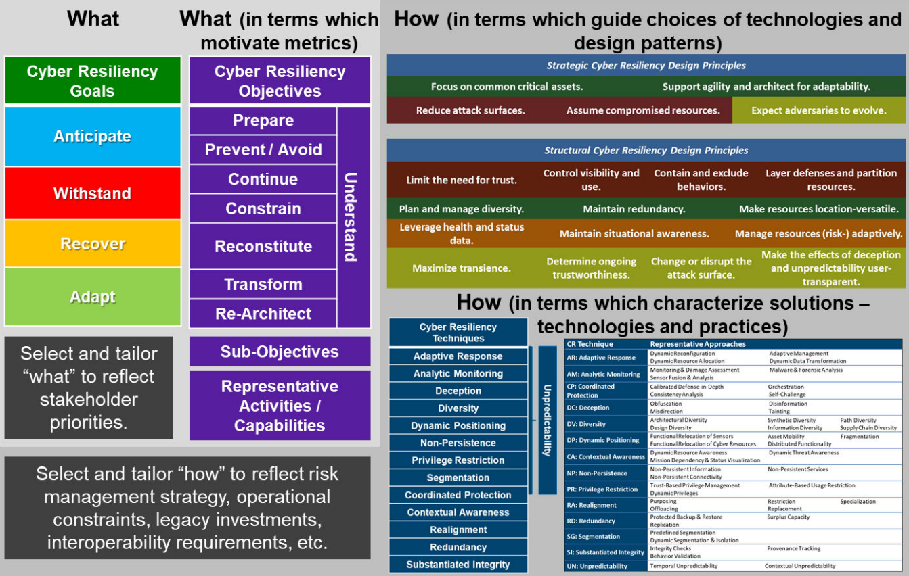
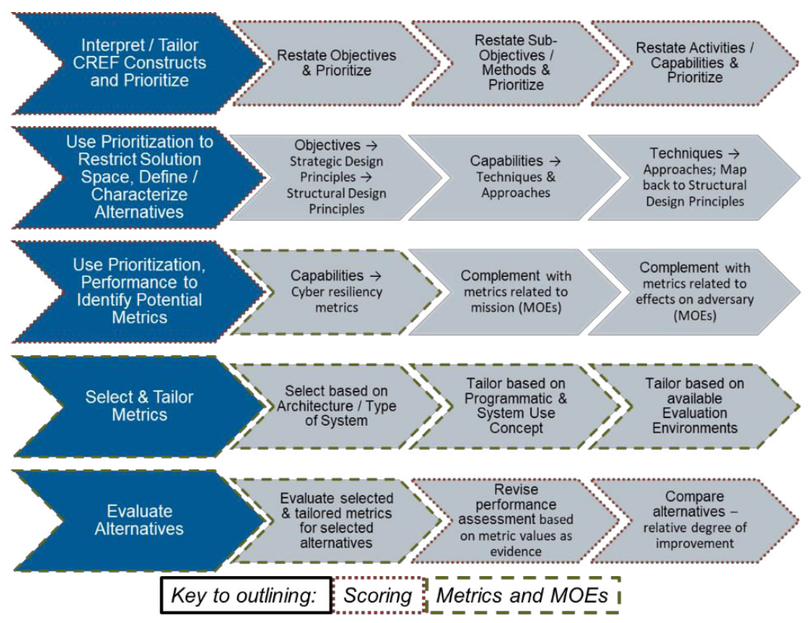
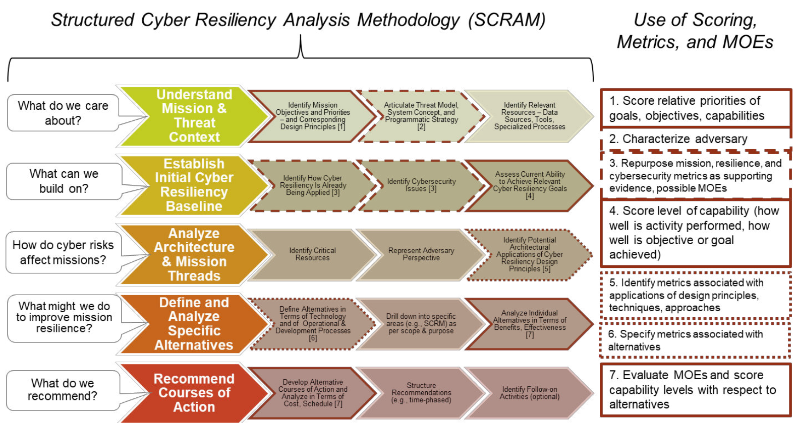
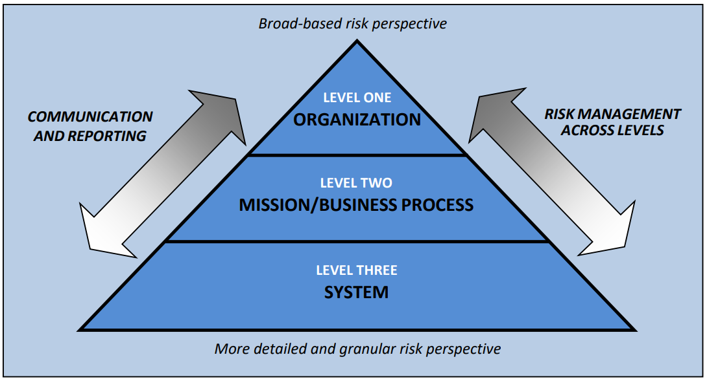
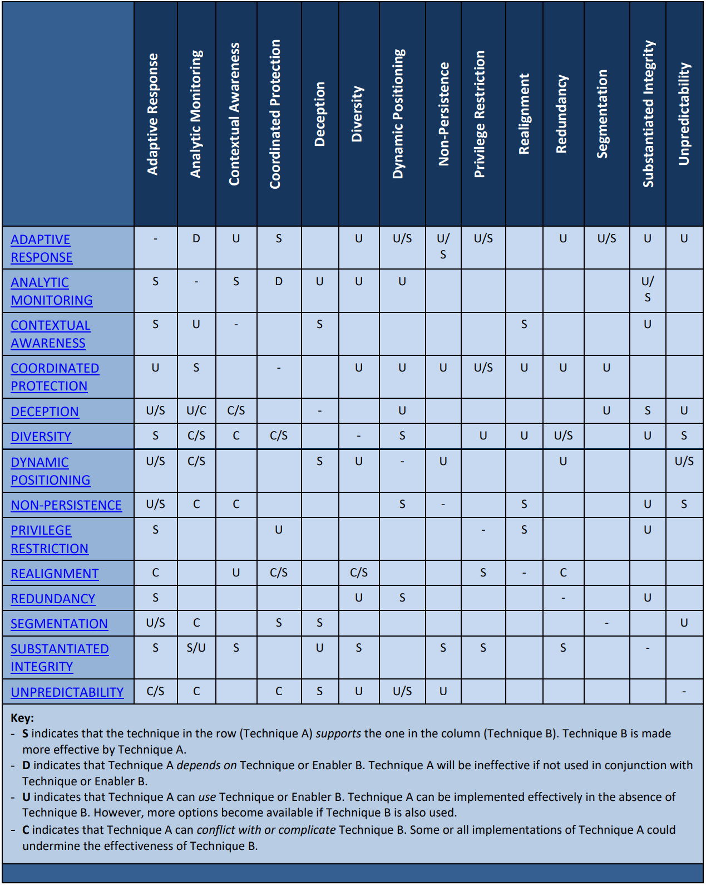
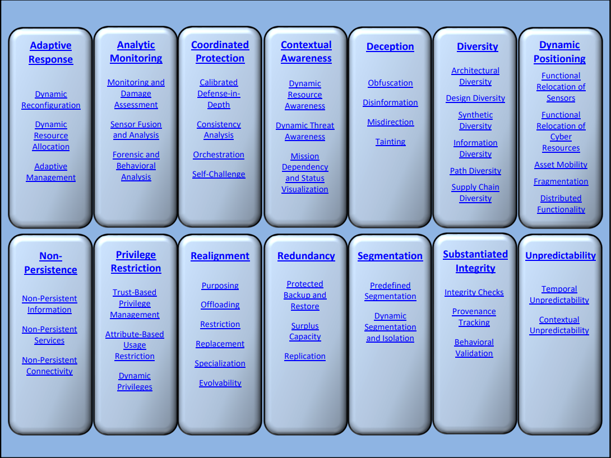
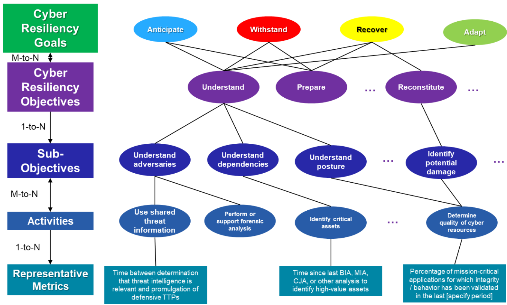
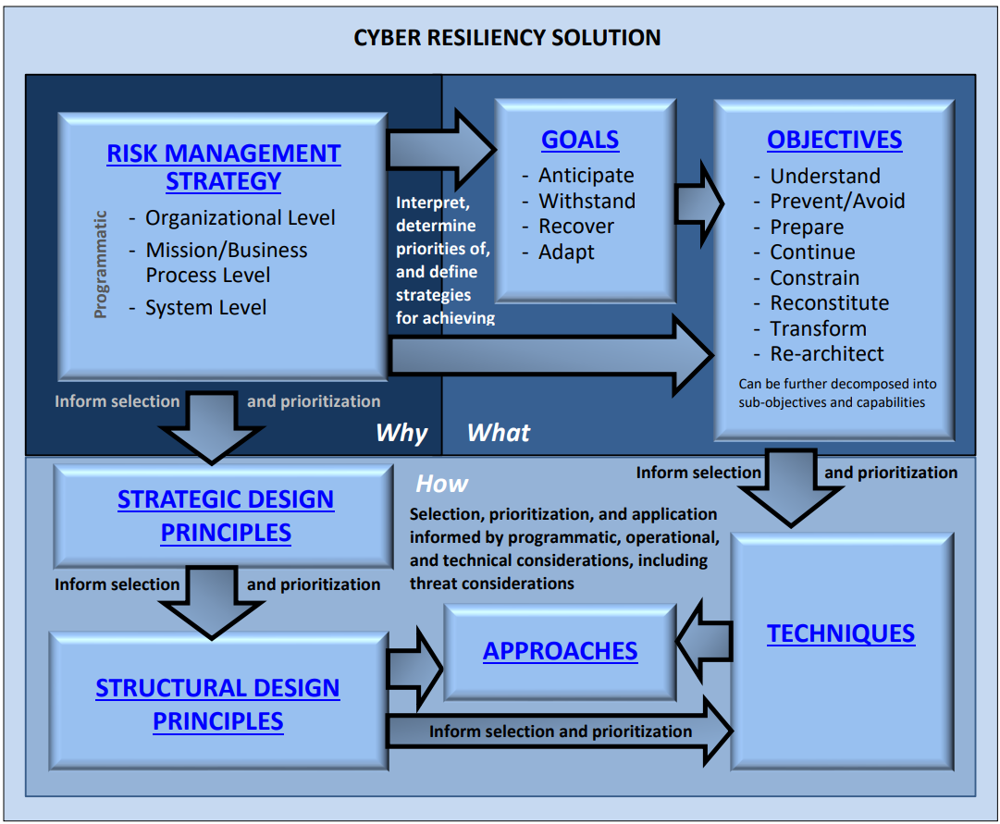
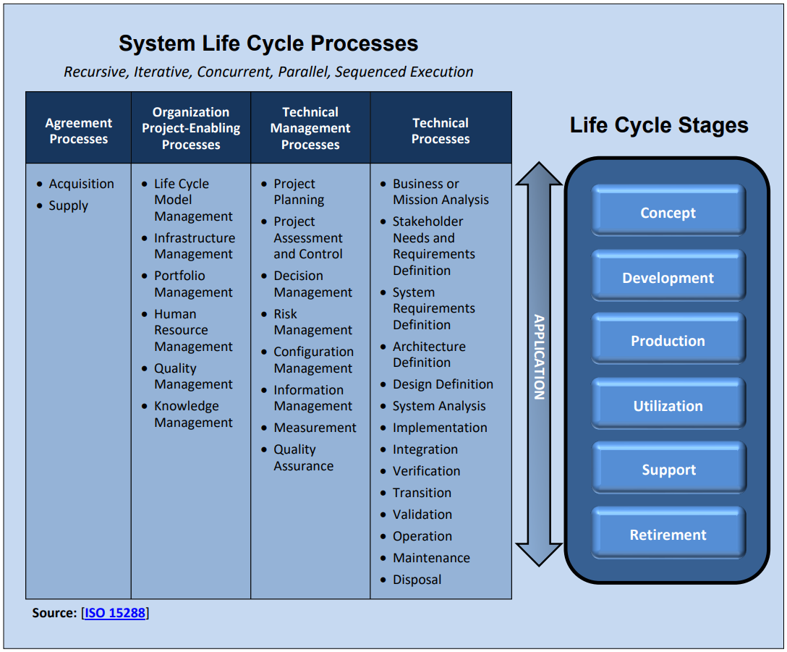

# NIST SP 800-160: Cyber Resiliency

NIST SP 800-160 focuses on the property of **cyber resiliency**, which is defined as the ability to:
- *Anticipate*: Predict and prepare for adverse conditions, stresses, attacks, or compromises.
- *Withstand*: Resist and endure adverse conditions or attacks.
- *Recover*: Restore functionality and operations after an adverse event.
- *Adapt*: Adjust to changing conditions and learn from past experiences.

## Levels of Cyber Resiliency

Cyber resiliency can be applied at multiple levels, including:
- **System Elements**: Individual components of a system.
- **Systems**: Entire systems or subsystems.
- **Missions or Business Functions**: Specific organizational objectives or tasks.
- **System-of-Systems**: Interconnected systems supporting broader functions.
- **Organizations, Sectors, and Regions**: Larger-scale entities or geographic areas.
- **The Nation or Transnational Missions/Business Functions**: National or global operations.

## Purpose of Cyber Resiliency

From an enterprise risk management perspective, cyber resiliency aims to reduce mission, business, organizational, or sector risks associated with potentially compromised cyber resources.

## Types of Systems Addressed in NIST 800-160

The document identifies considerations for engineering the following types of systems that depend on cyber resources:
1. **General-purpose or Multi-use Systems**: Examples include enterprise information technology (EIT), shared services, or common infrastructures.
2. **Dedicated or Special-purpose Systems**: Examples include security-dedicated or security-purposed systems.
3. **Large-scale Processing Environments**: Systems designed for high-volume data processing.
4. **Cyber-physical Systems (CPS)**: Systems that integrate computation, networking, and physical processes.
5. **Internet of Things (IoT) or Network of Things (NoT) Devices**: Devices interconnected via the internet or other networks.
6. **Systems-of-Systems**: Examples include critical infrastructure systems (CIS).

# Fundamentals

Cyber resiliency focuses on ensuring systems can withstand, recover from, and adapt to adverse conditions, whether caused by adversarial or non-adversarial threats. This is achieved through a combination of goals, objectives, techniques, and design principles.

**Key Concepts:**
1. **Goals and Objectives**: Define the **“what”** of cyber resiliency—what properties and behaviors are essential for resilient systems.
2. **Techniques and Design Principles**: Define the **“how”**—the methods and approaches to achieve or improve resiliency.
3. **Constructs**: Address both adversarial and non-adversarial threats from cyber and non-cyber sources.
4. **Engineering Practices**: Use methods, processes, and analytical techniques to design solutions that meet stakeholder requirements and protection needs.

## Cyber Resiliency Engineering Framework

The framework includes goals, objectives, techniques, implementation approaches, and design principles. These constructs can be applied at various levels, such as systems, organizations, or sectors. The following table summarizes the definition and purpose of each construct, and how each construct is applied at the system level.

| **CONSTRUCT** | **DEFINITION, PURPOSE, AND APPLICATION AT THE SYSTEM LEVEL** |
|---------------|--------------------------------------------------------------|
| **GOAL** | A high-level statement supporting (or focusing on) one aspect (i.e., anticipate, withstand, recover, adapt) in the definition of cyber resiliency. **Purpose**: Align the definition of cyber resiliency with definitions of other types of resilience. **Application**: Can be used to express high-level stakeholder concerns, goals, or priorities. |
| **OBJECTIVE** | A high-level statement (designed to be restated in system-specific and stakeholder-specific terms) of what a system must achieve in its operational environment and throughout its life cycle to meet stakeholder needs for mission assurance and resilient security. **Purpose**: Enable stakeholders and systems engineers to reach a common understanding of cyber resiliency concerns and priorities; facilitate the definition of metrics or measures of effectiveness (MOEs). **Application**: Used in scoring methods or summaries of analyses (e.g., cyber resiliency posture assessments). |
| **Sub-Objective** | A statement, subsidiary to a cyber resiliency objective, that emphasizes different aspects of that objective or identifies methods to achieve that objective. **Purpose**: Serve as a step in the hierarchical refinement of an objective into activities or capabilities for which performance measures can be defined.  **Application**: Used in scoring methods or analyses; may be reflected in system functional requirements. |
| **Activity or Capability** | A statement of a capability or action that supports the achievement of a sub-objective and, hence, an objective. **Purpose**: Facilitate the definition of metrics or MOEs. While a representative set of activities or capabilities have been identified in [Bodeau18b](https://www.mitre.org/sites/default/files/2021-11/prs-18-2579-cyber-resiliency-metrics-measures-of-effectiveness-and-scoring.pdf), these are intended solely as a starting point for selection, tailoring, and prioritization. **Application**: Used in scoring methods or analyses; reflected in system functional requirements. |
| **STRATEGIC DESIGN PRINCIPLE** | A high-level statement that reflects an aspect of the risk management strategy that informs systems security engineering practices for an organization, mission, or system. **Purpose**: Guide and inform engineering analyses and risk analyses throughout the system life cycle. Highlight different structural design principles, cyber resiliency techniques, and implementation approaches. **Application**: Included, cited, or restated in system non-functional requirements (e.g., requirements in a Statement of Work (SoW) for analyses or documentation). |
| **STRUCTURAL DESIGN PRINCIPLE** | A statement that captures experience in defining system architectures and designs. **Purpose**: Guide and inform design and implementation decisions throughout the system life cycle. Highlight different cyber resiliency techniques and implementation approaches. **Application**: Included, cited, or restated in system non-functional requirements (e.g., Statement of Work (SoW) requirements for analyses or documentation); used in systems engineering to guide the use of techniques, implementation approaches, technologies, and practices. |
| **TECHNIQUE** | A set or class of technologies, processes, or practices providing capabilities to achieve one or more cyber resiliency objectives. **Purpose**: Characterize technologies, practices, products, controls, or requirements so that their contribution to cyber resiliency can be understood. **Application**: Used in engineering analysis to screen technologies, practices, products, controls, solutions, or requirements; used in the system by implementing or integrating technologies, practices, products, or solutions. |
| **IMPLEMENTATION APPROACH** | A subset of the technologies and processes of a cyber resiliency technique defined by how the capabilities are implemented. **Purpose**: Characterize technologies, practices, products, controls, or requirements so that their contribution to cyber resiliency and their potential effects on threat events can be understood. **Application**: Used in engineering analysis to screen technologies, practices, products, controls, solutions, or requirements; used in the system by implementing or integrating technologies, practices, products, or solutions. |
| **SOLUTION** | A combination of technologies, architectural decisions, systems engineering processes, and operational processes, procedures, or practices that solves a problem in the cyber resiliency domain. **Purpose**: Provide a sufficient level of cyber resiliency to meet stakeholder needs and reduce risks to mission or business capabilities in the presence of advanced persistent threats. **Application**: Integrated into the system or its operational environment. |
| **MITIGATION** | An action or practice using a technology, control, solution, or a set of these that reduces the level of risk associated with a threat event or threat scenario. **Purpose**: Characterize actions, practices, approaches, controls, solutions, or combinations of these in terms of their potential effects on threat events, threat scenarios, or risks. **Application**: Integrated into the system as it is used. |

### Cyber Resiliency Goals

Cyber resiliency goals provide a foundation for risk management decisions across different levels of an organization. The four primary goals are:

1. **Anticipate**: Predict and prepare for potential threats or adverse conditions.
2. **Withstand**: Resist and endure attacks or adverse conditions.
3. **Recover**: Restore functionality after an adverse event.
4. **Adapt**: Adjust to changing conditions and learn from past experiences.

### Cyber Resiliency Objectives

Cyber resiliency objectives are specific outcomes systems should achieve to meet stakeholder needs. These objectives can be tailored to reflect organizational missions or operational concepts.

#### Objectives and Descriptions

- **Prevent or Avoid**: Preclude successful attacks or adverse conditions.
 - Apply basic protection measures and controls tailored to the risks of the system of interest.
 - Limit exposure to threat events.
 - Decrease the adversary’s perceived benefits.
 - Modify configurations based on threat intelligence.
- **Prepare**: Maintain realistic courses of action for anticipated adversity.
 - Create and maintain cyber courses of action.
 - Maintain the resources needed to execute cyber courses of action.
 - Validate the realism of cyber courses of action using testing or exercises.
- **Continue**: Maximize the duration and viability of essential functions during adversity.
 - Minimize the degradation of service delivery.
 - Minimize interruptions in service delivery.
 - Ensure that ongoing functioning is correct.
- **Constrain**: Limit damage from adverse events.
 - Identify potential damage.
 - Isolate resources to limit future or further damage.
 - Move resources to limit future or further damage.
 - Change or remove resources and how they are used in order to limit future or further damage.
- **Reconstitute**: Restore as much functionality as possible after adversity.
 - Identify untrustworthy resources and damage.
 - Restore functionality.
 - Heighten protections during reconstitution.
 - Determine the trustworthiness of restored or reconstructed resources.
- **Understand**: Maintain awareness of dependencies and resource status.
 - Understand adversaries.
 - Understand dependencies on and among systems containing cyber resources.
 - Understand the status of resources with respect to threat events.
 - Understand the effectiveness of security controls and controls supporting cyber resiliency.
- **Transform**: Modify workflows and processes to handle adversity effectively.
 - Redefine mission or business process threads for agility.
 - Redefine mission or business functions to mitigate risks.
- **Re-Architect**: Redesign system architectures to address adversity and environmental changes.
 - Restructure systems or sub-systems to reduce risks.
 - Modify systems or sub-systems to reduce risks.

### Cyber Resiliency Techniques and Approaches

The framework identifies 14 techniques to achieve cyber resiliency. These techniques are interdependent and can address both adversarial and non-adversarial threats.

#### Techniques

| **TECHNIQUE** | **DEFINITION** | **PURPOSE** |
|---------------|----------------|-------------|
| **ADAPTIVE RESPONSE** | Implement agile courses of action to manage risks. | Optimize the ability to respond in a timely and appropriate manner to adverse conditions, stresses, attacks, or indicators of these, thus maximizing the ability to maintain mission or business operations, limit consequences, and avoid destabilization. |
| **ANALYTIC MONITORING** | Monitor and analyze a wide range of properties and behaviors on an ongoing basis and in a coordinated way. | Maximize the ability to detect potential adverse conditions; reveal the extent of adverse conditions, stresses, or attacks; identify potential or actual damage, and investigate adversary TTPs. Provide the data needed for situational awareness. |
| **CONTEXTUAL AWARENESS** | Construct and maintain current representations of the posture of organizational missions or business functions while considering threat events and courses of action. | Support situational awareness. Enhance understanding of dependencies among cyber and non-cyber resources. Reveal patterns or trends in adversary behavior. |
| **COORDINATED PROTECTION**| Ensure that protection mechanisms operate in a coordinated and effective manner. | Require a threat event to overcome multiple safeguards (i.e., employ a strategy of defense-in-depth). Increase the difficulty for an adversary to successfully attack critical resources by increasing the cost to the adversary and raising the likelihood of adversary detection. Validate the realism of cyber courses of action. |
| **DECEPTION** | Mislead, confuse, hide critical assets from the adversary, or expose covertly tainted assets to the adversary. | Mislead, confuse, or hide critical assets from the adversary, delaying the effect of the attack, increasing the risk of being discovered, causing the adversary to misdirect or waste its resources, and exposing the adversary tradecraft prematurely. |
| **DIVERSITY** | Use heterogeneity to minimize common mode failures, particularly threat events exploiting common vulnerabilities. | Limit the possibility of the loss of critical functions due to the failure of replicated common critical components. Increase the probability that some of the defending organization’s systems will survive the adversary’s attack. |
| **DYNAMIC POSITIONING** | Distribute and dynamically relocate functionality or system resources. | Increase the ability to rapidly recover from non-adversarial events (e.g., fires, floods) as well as from adversarial threat events (e.g., cyber-attacks). Impede an adversary’s ability to locate, eliminate, or corrupt mission or business assets. |
| **NON-PERSISTENCE** | Generate and retain resources as needed or for a limited time. | Reduce exposure to corruption, modification, or compromise. Provide a means of curtailing an adversary’s intrusion and advance by potentially removing malware or damaged resources from the system. |
| **PRIVILEGE RESTRICTION** | Restrict privileges based on the attributes of users and system elements as well as on environmental factors. | Limit the impact and probability that unintended actions by authorized individuals will compromise information or services. Impede an adversary by requiring them to invest more time and effort in obtaining credentials. |
| **REALIGNMENT** | Structure systems and resource uses to meet mission or business function needs, reduce current and anticipated risks, and accommodate the evolution of technical, operational, and threat environments. | Minimize the connections between mission-critical and non-critical services, reducing the likelihood that a failure of non-critical services will impact mission-critical services. Reduce the attack surface of the defending organization by minimizing the probability that non-mission or business functions could be used as an attack vector. Accommodate changing mission or business function needs. Accommodate changes in the technical environment. |
| **REDUNDANCY** | Provide multiple protected instances of critical resources. | Reduce the consequences of the loss of information or services. Facilitate recovery from the effects of an adverse cyber event. Limit the time during which critical services are denied or limited. |
| **SEGMENTATION** | Define and separate system elements based on criticality and trustworthiness. | Contain adversary activities and non-adversarial stresses (e.g., fires, floods) to the enclave, system segment, or facility in which they have established a presence. Limit the set of possible targets to which malware can be easily propagated. |
| **SUBSTANTIATED INTEGRITY** | Ascertain whether critical system elements have been corrupted. | Facilitate the determination of correct results in case of conflicts between diverse services or inputs. Detect attempts by an adversary to deliver compromised data, software, or hardware, as well as successful modification or fabrication. |
| **UNPREDICTABILITY** | Make changes randomly or unpredictably. | Increase an adversary’s uncertainty regarding the system protections that they may encounter, making it more difficult for them to ascertain the appropriate course of action. Serve as a force multiplier for other techniques. |

### Cyber Resiliency Design Principles

Design principles guide systems engineers and architects in making decisions to enhance resiliency. These principles include:
- **Minimize Attack Surfaces**: Reduce opportunities for adversaries to exploit vulnerabilities.
- **Ensure Trustworthiness**: Build systems that can be trusted even under adverse conditions.
- **Promote Agility**: Enable systems to adapt quickly to changing environments.

| **strategic Design Principles & Analytic Practices** | **risk Framing Elements of Risk Management Strategy** |
|-----------------|----------------------|
| **FOCUS ON COMMON CRITICAL ASSETS** - **Practices**: Criticality Analysis, Business Impact Analysis (BIA), Mission Impact Analysis (MIA), Mission Thread Analysis. | **Threat assumptions**: Conventional adversary; advanced adversary seeking path of least resistance. **Risk response constraints**: Limited programmatic resources. **Risk response priorities**: Anticipate, Withstand, Recover. |
| **SUPPORT AGILITY AND ARCHITECT FOR ADAPTABILITY** - **Practices**: Analysis of standards conformance, interoperability analysis, reusability analysis. | **Threat assumptions**: Adaptive, agile adversary. **Risk response constraints**: Missions to be supported and mission needs can change rapidly. **Risk response priorities**: Recover, Adapt. |
| **REDUCE ATTACK SURFACES** - **Practices**: Supply Chain Risk Management (SCRM) analysis, vulnerability and exposure analysis, Operations Security (OPSEC) analysis, Cyber-attack modeling and simulation. | **Threat assumptions**: Conventional adversary; advanced adversary seeking path of least resistance. **Risk response constraints**: Limited operational resources to monitor and actively defend systems. **Risk response priorities**: Anticipate. |
| **ASSUME COMPROMISED RESOURCES** - **Practices**: Cascading failure analysis, Insider Threat analysis, Cyber-attack modeling and simulation. | **Threat assumptions**: Advanced adversary. **Risk response constraints**: Ability to assure the trustworthiness of system elements is limited. **Risk response priorities**: Anticipate, Withstand. |
| **EXPECT ADVERSARIES TO EVOLVE** - **Practices**: Adversary-driven Cyber Resiliency (ACR) analysis, Red Teaming. | **Threat assumptions**: Advanced adversary; adversary can change TTPs and goals unpredictably. **Risk response constraints**: None specified. **Risk response priorities**: Anticipate, Adapt. |

#### Strategies for Reduce Attack Surfaces

| **Strategy** | **Security Control Supporting Strategy** | **Related Techniques** |
|--------------|------------------------------------------|------------------------|
| **Reduce the Extent of the Attack Surface** | Attack surface reduction includes implementing the concept of layered defenses, applying the principles of least privilege and least functionality, deprecating unsafe functions, and applying secure software development practices, including reducing entry points available to unauthorized users, reducing the amount of code that executes, and eliminating application programming interfaces (APIs) that are vulnerable to cyber-attacks. | - **Coordinated Protection** - **Privilege Restriction** - **Realignment** |
| **Reduce the Exposure (Structural Accessibility) of the Attack Surface** | Attack surface reduction includes implementing the concept of layered defenses and applying the principles of least privilege and least functionality | - **Privilege Restriction** - **Coordinated Protection** |
| **Reduce the Exposure (Structural Accessibility) of the Attack Surface** | Component isolation reduces the attack surface of organizational systems. | - **Adaptive Response** - **Segmentation** |
| **Reduce the Duration (Temporal Accessibility) of Attack Surface Exposure** | The implementation of non-persistent components and services mitigates risk from advanced persistent threats (APTs) by reducing the targeting capability of adversaries (i.e., window of opportunity and available attack surface) to initiate and complete attacks. | - **Non-persistence** |

#### Structural Cyber Resiliency Design Principles

| **Structural Design Principles** | **Key Ideas** | **Related Design Principles from other Disciplines** |
|--------------|----------------------|-------------------------------------------------|
| **MAXIMIZE TRANSIENCE** | Use of transient system elements minimizes the duration of exposure to adversary activities, while periodically refreshing to a known (secure) state can expunge malware or corrupted data. | **Resilience Engineering**: Localized Capacity, Loose Coupling. **Survivability**: Avoidance. |
| **DETERMINE ONGOING TRUSTWORTHINESS** | Periodic or ongoing verification and/or validation of the integrity or correctness of data or software can increase the effort needed by an adversary seeking to modify or fabricate data or functionality. | **Security**: Self-Reliant Trustworthiness, Continuous Protection, Secure Metadata Management, Self-Analysis, Accountability and Traceability. **Resilience Engineering**: Neutral State. **Survivability**: Fail-Safe. |
| **CHANGE OR DISRUPT THE ATTACK SURFACE** | Disruption of the attack surface can cause the adversary to waste resources, make incorrect assumptions about the system or the defender, or prematurely launch attacks or disclose information. | **Resilience Engineering**: Drift Correction. **Survivability**: Mobility, Deterrence, Preemption, Avoidance. |
| **MAKE THE EFFECTS OF DECEPTION AND UNPREDICTABILITY USER-TRANSPARENT** | Deception and unpredictability can be highly effective techniques against an adversary, leading the adversary to reveal its presence or TTPs or to waste effort. However, when improperly applied, these techniques can also confuse users. | **Security**: Efficiently Mediated Access, Performance Security, Human Factored Security, Acceptable Security. **Survivability**: Concealment. |
| **LAYER DEFENSES AND PARTITION RESOURCES** | The combination of defense-in-depth and partitioning increases the effort required by an adversary to overcome multiple defenses. | **Security**: Modularity and Layering, Partially Ordered Dependencies, Minimized Sharing, Self-Reliant Trustworthiness, Secure Distributed Composition. **Resilience Engineering**: Layered Defense. **Survivability**: Hardness, Fail-Safe. |
| **PLAN AND MANAGE DIVERSITY** | Diversity is a well-established resilience technique that removes single points of attack or failure. However, architectures and designs should take cost and manageability into consideration to avoid introducing new risks. | **Resilience Engineering**: Absorption, Repairability. **Survivability**: Heterogeneity. |
| **MAINTAIN REDUNDANCY** | Redundancy is key to many resilience strategies but can degrade over time as configurations are updated or connectivity changes. | **Resilience Engineering**: Absorption, Physical Redundancy, Functional Redundancy. **Survivability**: Redundancy, Margin. |
| **MAKE RESOURCES LOCATION-VERSATILE** | A resource bound to a single location (e.g., a service running only on a single hardware component, a database located in a single datacenter) can become a single point of failure and, thus, a high-value target. | **Resilience Engineering**: Localized Capacity, Repairability. **Survivability**: Mobility, Avoidance, Distribution. |
| **LEVERAGE HEALTH AND STATUS DATA** | Health and status data can be useful in supporting situational awareness, indicating potentially suspicious behaviors, and predicting the need for adaptation to changing operational demands. | **Resilience Engineering**: Drift Correction, Inter-Node Interaction. |
| **MAINTAIN SITUATIONAL AWARENESS** | Situational awareness, including the awareness of possible performance trends and the emergence of anomalies, informs decisions about cyber courses of action to ensure mission completion. | **Resilience Engineering**: Drift Correction, Inter-Node Interaction. |
| **MANAGE RESOURCES (RISK-) ADAPTIVELY** | Risk-adaptive management supports agility and provides supplemental risk mitigation throughout critical operations despite disruptions or outages of components. | **Security**: Trusted Components, Hierarchical Trust, Inverse Modification Threshold, Secure Distributed Composition, Trusted Communications Channels, Secure Defaults, Secure Failure and Recovery. **Resilience Engineering**: Reorganization, Repairability, Inter-Node Interaction. **Survivability**: Avoidance. |
| **LIMIT THE NEED FOR TRUST** | Limiting the number of system elements that need to be trusted (or the length of time for which an element needs to be trusted) reduces the level of effort needed for assurance, ongoing protection, and monitoring. | **Security**: Least Common Mechanism, Trusted Components, Inverse Modification Threshold, Minimized Security Elements, Least Privilege, Predicate Permission, Self-Reliant Trustworthiness, Trusted Communications Channels. **Resilience Engineering**: Localized Capacity, Loose Coupling. **Survivability**: Prevention. |
| **CONTROL VISIBILITY AND USE** | Controlling what can be discovered, observed, and used increases the effort needed by an adversary seeking to expand its foothold in or increase its impacts on systems containing cyber resources. | **Security**: Clear Abstraction, Least Common Mechanism, Least Privilege, Predicate Permission. **Resilience Engineering**: Localized Capacity, Loose Coupling. **Survivability**: Concealment, Hardness. |
| **CONTAIN AND EXCLUDE BEHAVIORS** | Limiting what can be done and where actions can be taken reduces the possibility or extent of the spread of compromises or disruptions across components or services. | **Security**: Trusted Components, Least Privilege, Predicate Permission. **Resilience Engineering**: Localized Capacity, Loose Coupling. **Survivability**: Prevention. |

### Relationship Among Cyber Resiliency Constructs

The constructs—goals, objectives, techniques, and design principles—are interconnected and relate to risk management. Systems engineers use these constructs to analyze solutions in terms of their impact on risk and specific threat events.

## Cyber Resiliency in the System Life Cycle

This section outlines how cyber resiliency concepts and framework constructs are applied across the system life cycle stages. It addresses differences in security and cyber resiliency terminology and how goals, objectives, techniques, and design principles influence key stages.

### Life Cycle Stages and Cyber Resiliency Constructs

1. **Concept Stage**
 - Prioritize and tailor objectives based on the system's concept of use.
 - Align design principles with other disciplines and limit applicable techniques.
 - Identify cyber resiliency concerns for production, integration, validation, and supply chain management.
2. **Development Stage**
 - Apply design principles to shape system architecture and prioritize objectives.
 - Analyze and define cyber resiliency solutions using techniques and approaches.
 - Verify solutions for effectiveness and compatibility with trustworthiness.
3. **Production Stage**
 - Implement and evaluate cyber resiliency solutions in stressed environments.
 - Address production, integration, validation, and supply chain concerns.
4. **Utilization Stage**
 - Monitor the effectiveness of solutions in operational environments.
 - Adapt processes and reprioritize objectives to address environmental changes.
5. **Support Stage**
 - Revisit objectives and constraints based on monitoring results.
 - Modify or upgrade capabilities to align with operational, threat, and technical changes.
6. **Retirement Stage**
 - Address vulnerabilities introduced during system decommissioning.
 - Ensure disposal processes do not compromise cyber resiliency objectives.

## Risk Management and Cyber Resiliency

Organizations manage risks related to systems with cyber resources as part of a broader portfolio, including financial, reputational, and operational risks. Cyber resiliency solutions primarily aim to reduce mission, business, and operational risks but may also influence other risk types (e.g., financial or schedule risks).

### Key Considerations for Risk Management

- **Impact of Solutions**: Assess how proposed solutions affect organizational risk tolerance and strategy.
- **Dynamic Environment**: Address risks associated with evolving technologies, processes, and threat landscapes.
- **Adaptation Goals**: Ensure solutions align with the "Adapt" goal by addressing changes in attack surfaces, dependencies, and operational procedures.

### Questions to Guide Risk Management

- How does each step in a transition plan affect the attack surface?
- Are new attack vectors introduced? How will they be mitigated?
- Does this step increase complexity or instability? How will those risks be managed?
- What dependencies exist on other programs or initiatives? How will risks be addressed if objectives are not met?
- What new or modified operational procedures are assumed? How will they be resourced?
- How will cyber resiliency objectives continue to be achieved amidst changes?

# Cyber Resiliency in Practice

Cyber resiliency in practice emphasizes selecting the most relevant cyber resiliency measures for a system’s unique context and then applying them through a process that includes analysis, tailoring, and integration. It highlights the importance of understanding how different cyber resiliency concepts relate to other assurance disciplines, recognizing that no single approach is universally appropriate, and addressing specific organizational or mission needs and constraints.

## Selecting and Prioritizing Cyber Resiliency Constructs

| Factor | Sub-Factor | Key Considerations |
|--------|------------|--------------------|
| **Achievement of Goals and Objectives** | | Cyber resiliency techniques should align with resiliency goals/objectives, guided by mission or business priorities to protect critical assets and services. |
| **Cyber Risk Management Strategy** | | Decisions guided by organization's cyber risk management strategy, considering risk tolerance, regulatory constraints, and available resources. Focus on addressing unacceptable risks and the need to disrupt or expose adversaries. |
| **System Type** | | Selection varies significantly by system characteristics, operational context, and specific constraints. |
| | Enterprise IT Systems | Support broad and diverse missions; nearly all resiliency techniques apply, balanced against performance and resiliency trade-offs. |
| | Large-Scale Processing Environments | Require solutions minimizing disruption and maintaining high-confidence services; use techniques like process restriction/offloading and dynamic repositioning. |
| | System-of-Systems | Need coordinated defenses, segmentation, and mission-dependency visualization to protect complex interdependencies and limit adversary movement. |
| | Critical Infrastructure Systems | Emphasize redundancy, diversity, component isolation, and strict privilege management for deterministic systems critical to safety and society. |
| | Cyber-Physical Systems | Limited computational resources; apply non-persistence and integrity checks while balancing operational constraints and connectivity limitations. |
| | Internet of Things | Constrained devices necessitate lightweight integrity mechanisms, segmentation, and realignment at the system level. Avoid impractical methods like heavy obfuscation or deception. |
| **Cyber Resiliency Conflicts and Synergies** | | Balance reinforcing and conflicting resiliency techniques; redundancy and diversity increase adversary burden but also expand attack surfaces. Deception and non-persistence complicate adversaries’ efforts but challenge monitoring efforts. |
| **Other Disciplines and Existing Investments** | | Adapt and leverage existing solutions from related disciplines to enhance cyber resiliency against advanced persistent threats. |
| | Investments from Cybersecurity, COOP, and Resilience Engineering | Established practices (redundancy, monitoring, segmentation) require additional enhancements to counter advanced threats effectively. |
| | Investments from Non-Adversarial Disciplines | Techniques from safety and reliability (diversity, integrity validation) need strengthening (e.g., cryptographic checks, automated reconfiguration) to defend against advanced adversaries. |
| | Investments from Adversarial Disciplines | Military-inspired strategies (deception, unpredictability) effectively mislead adversaries but present integration challenges due to lack of counterparts in non-adversarial disciplines. |
| **Architectural Locations** | | Implementation location (hardware, network, application) significantly influences feasibility and effectiveness. Hardware-level interventions offer deeper, limited-scope protection; network/application-level solutions have broader but varying impacts. |
| **Effects on Adversaries, Threats, and Risks** | | Consider techniques based on potential to disrupt adversarial activities, impede success, or alter adversaries’ risk and cost-benefit calculations across scenarios. |
| **Maturity and Potential Adoption** | | Evaluate technical maturity when adopting solutions; mature practices from non-adversarial fields have low integration risk but may be inadequate for advanced threats. Emerging techniques (moving-target defenses, deception) offer strong protection with higher integration uncertainty. |

### Analytic Practices & Processes

| Stage | Sub-stage | Key Considerations |
|-------|-----------|--------------------|
| **Understand the Context** | | Establish the foundation for cyber resiliency analysis by considering programmatic, architectural, operational, and threat factors. |
| | **Identify the Programmatic Context** | Define stakeholders, budget/schedule constraints, quality priorities (security, reliability), and dependencies on external programs that influence resiliency. |
| | **Identify the Architectural Context** | Clarify system architecture (hardware/software layers, interfaces, operational environments) to determine feasible resiliency solutions. |
| | **Identify the Operational Context** | Identify critical mission functions, user interactions, dependencies, and operational constraints to inform suitable resiliency measures. |
| | **Identify the Threat Context** | Profile threats (advanced persistent threats, insider threats), understanding adversary motivations and tactics to guide effective defense strategies. |
| | **Interpret and Prioritize Cyber Resiliency Constructs** | Align cyber resiliency objectives, principles, and techniques with identified contexts; exclude irrelevant methods to focus on key resiliency measures. |
| **Develop the Cyber Resiliency Baseline** | | Establish current capabilities and identify gaps or issues to inform resiliency improvement. |
| | **Establish Initial Cyber Resiliency Baseline** | Assess current capabilities from continuity of operations, cybersecurity, and resilience areas to leverage existing methods against advanced threats. |
| | **Identify Gaps and Issues** | Recognize shortfalls exposed during exercises or incidents; map these gaps to specific cyber resiliency constructs for targeted improvement. |
| | **Define Evaluation Criteria and Make Initial Assessment** | Set qualitative or quantitative criteria for measuring objectives achievement, risk reduction, and threat coverage to guide further analysis. |
| **Analyze the System** | | Conduct detailed analyses from mission and adversary perspectives to find critical weaknesses and identify opportunities for improvement. |
| | **Identify Critical Resources, Sources of Fragility, and Attack Surfaces** | Identify assets whose compromise significantly disrupts mission performance, highlighting areas requiring prioritized protection. |
| | **Represent the Adversary Perspective** | Model how attackers penetrate and maneuver within the system, targeting valuable resources, thus informing effective countermeasures. |
| | **Identify and Prioritize Opportunities for Improvement** | Map resiliency techniques to specific system locations or processes where adversary actions can be disrupted, thwarted, or mitigated. |
| **Define and Analyze Specific Alternatives** | | Identify, assess, and prioritize specific improvements to enhance system resiliency against threats. |
| | **Define Potential Technical and Procedural Solutions** | Propose hardware/software updates, new security controls, or operational changes based on system type, risk management preferences, and maturity levels. |
| | **Define Potential Solutions for Supporting Systems and Processes** | Suggest enhancements in supply chains, integration, maintenance, and vendor management processes to bolster overall resiliency. |
| | **Analyze Potential Solutions with Respect to Criteria** | Evaluate candidate solutions by estimating their effectiveness, coverage, impact on adversary cost, and alignment with mission objectives. |
| **Develop Recommendations** | | Create a structured plan of action with phased strategies for enhancing cyber resiliency. |
| | **Identify and Analyze Alternatives** | Propose multiple solution options, evaluating synergies, conflicts, complexity, and resource investment; suggest sequencing based on dependencies. |
| | **Assess Alternatives** | Compare alternatives using metrics, expert judgment, and risk assessments to identify combinations that most effectively improve resiliency. |
| | **Recommend a Plan of Action** | Recommend specific technical implementations, phased deployment strategies, and continuous updates to ensure alignment with evolving missions, threats, and technologies. |
